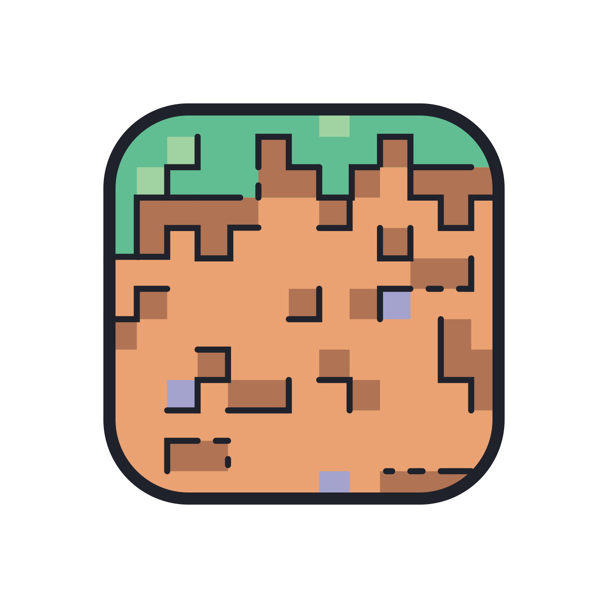

<p align="center"></p>

<h1 align="center">Feather Launcher</h1>

<h3 align="center"><a href="https://github.com/dscalzi/HeliosLauncher">Forked from Helios Launcher</a></h3>

<p align="center">Java, Forge, 모드 설치 걱정 없이 서버에 접속하세요. Feather 런처 하나로 준비 끝!</p>

## 기능

* 🔒 통합 계정 관리
  * 여러 계정을 등록하고 쉽게 계정 전환을 할 수 있어요.
  * Microsoft (OAuth 2.0) + Mojang (Yggdrasil) 인증을 모두 지원해요.
  * 계정 정보는 저장되지 않고 Mojang에 직접 전송돼요.
* 📂 효율적인 데이터 관리
  * 클라이언트 업데이트를 빠르게 받아보세요.
  * 게임 실행 전에 파일 유효성을 검사하고 문제가 있으면 다시 다운로드해요.
* ☕ **자동 Java 유효성 검사**
  * 호환되지 않는 Java 버전이 설치되어 있으면 올바른 버전을 **자동으로** 설치해요.
  * 런처를 실행하기 위해 Java를 설치할 필요가 없어요.
* 📰 런처에 내장된 뉴스 피드
* ⚙️ Java 설정이 가능한 직관적인 설정 화면
* 런처는 자동으로 업데이트돼요.
* Mojang 서비스 상태를 확인할 수 있어요.

이 외에도 런처가 할 수 있는 일은 많아요. 지금 다운로드해서 사용해보세요!

#### 도움이 필요하신가요? [위키를 확인해보세요.][wiki]

#### 프로젝트가 마음에 드셨나요? [원작자(dscalzi)](https://github.com/dscalzi)의 [원본 레포지토리(HeliosLauncher)](https://github.com/dscalzi/HeliosLauncher)에 ⭐ 스타를 남겨주세요!

## 다운로드

[GitHub Releases](https://github.com/opplease3/FeatherLauncher/releases)에서 다운로드할 수 있어요.

**지원하는 플랫폼**

[Releases](https://github.com/opplease3/Feather-Launcher/releases) 탭에서 시스템 OS에 맞는 설치 파일을 선택해서 다운로드하세요.아직은 윈도우 밖에지원하지않아요.

| 플랫폼 | 파일 |
| -------- | ---- |
| Windows x64 | `MRS-Launcher-setup-VERSION.exe` |
[^1]: macOS 설치 파일은 서명되지 않아서 보안 경고가 뜰 수 있으며 정상 작동을 보장하지 않아요.

## 콘솔

콘솔창을 열려면 아래 단축키를 사용하세요.

```console
ctrl + shift + i
```

콘솔창이 열리면 콘솔 탭이 선택되어 있는지 확인하세요. 개발자가 아니라면 콘솔에 아무거나 입력하지 마세요. 인터넷이나 타인이 알려준 코드를 함부로 입력하면 민감한 정보가 노출될 수 있어요.

#### 콘솔 출력을 파일로 내보내기

콘솔 출력을 내보내려면 콘솔 어디에서든 마우스 오른쪽 버튼을 클릭하고 **다른 이름으로 저장**을 클릭하세요.


## 개발

이 섹션에서는 기본 개발 환경 설정 방법을 설명해요.

### 시작하기

**시스템 요구사항**

* [Node.js][nodejs] v20

---

**레포지토리 클론 및 의존 패키지 설치**

```console
> git clone https://github.com/opplease3/FeatherLauncher.git
> cd FeatherLauncher
> npm install
```

---

**어플리케이션 실행**

```console
> npm start
```

---

**인스톨러 빌드**

현재 개발하고 있는 플랫폼에 맞는 인스톨러를 빌드하려면 아래 명령어를 사용하세요.

```console
> npm run dist
```

특정 플랫폼에 맞게 빌드하려면 아래 명령어를 사용하세요.

| 플랫폼    | 명령어              |
| ----------- | -------------------- |
| Windows x64 | `npm run dist:win`   |
| macOS       | `npm run dist:mac`   |
| Linux x64   | `npm run dist:linux` |

macOS 빌드는 macOS에서만 가능해요. Windows나 Linux에서 macOS 빌드를 시도하면 제대로 빌드되지 않아요.

---

### Visual Studio Code

런처 개발은 [Visual Studio Code][vscode]를 사용해서 진행해야 해요.

아래 내용을 `.vscode/launch.json`에 붙여넣기하세요.

```JSON
{
  "version": "0.2.0",
  "configurations": [
    {
      "name": "Debug Main Process",
      "type": "node",
      "request": "launch",
      "cwd": "${workspaceFolder}",
      "program": "${workspaceFolder}/node_modules/electron/cli.js",
      "args" : ["."],
      "outputCapture": "std"
    },
    {
      "name": "Debug Renderer Process",
      "type": "chrome",
      "request": "launch",
      "runtimeExecutable": "${workspaceFolder}/node_modules/.bin/electron",
      "windows": {
        "runtimeExecutable": "${workspaceFolder}/node_modules/.bin/electron.cmd"
      },
      "runtimeArgs": [
        "${workspaceFolder}/.",
        "--remote-debugging-port=9222"
      ],
      "webRoot": "${workspaceFolder}"
    }
  ]
}
```

이렇게 하면 두 개의 디버그 설정이 추가돼요.

#### 메인 프로세스 디버그

Electron의 [메인 프로세스][mainprocess]를 디버깅할 수 있어요. [렌더러 프로세스][rendererprocess]의 스크립트를 디버깅하려면 DevTools 창을 열어야 해요.

#### Debug Renderer Process

Electron의 [렌더러 프로세스][rendererprocess]를 디버깅할 수 있어요. 이 디버그 설정을 사용하려면 [Debugger for Chrome][chromedebugger] 확장을 설치해야 해요.

이 디버그 설정을 사용하는 동안에는 DevTools 창을 열 수 없어요. Chromium은 하나의 디버거만 허용하고 두 번째 디버거를 열면 프로그램 충돌이 발생해요.

---

### 제 3자 사용에 대한 주의사항

원작자([dscalzi](https://github.com/dscalzi))와 원본 레포지토리 링크([Helios Launcher](https://github.com/dscalzi/HeliosLauncher))를 표기하여 출처를 명시하면 무료로 사용할 수 있어요.

Microsoft 인증 설정 방법은 [여기](https://github.com/dscalzi/HeliosLauncher/blob/master/docs/MicrosoftAuth.md)를 참고하세요.

---

## 리소스

* [위키][wiki]
* [Nebula (Distribution.json 생성)][nebula]
* [v2 Rewrite Branch (비활성화)][v2branch]

아래 디스코드에서 개발자들과 소통할 수 있어요.

[][discord]

---
